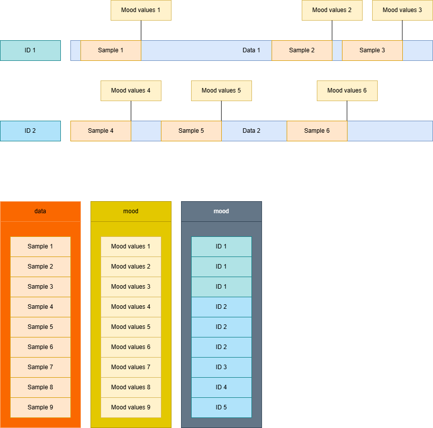

# AI-framework

This repository contains the code for the framework used to train ML-models for the research project BeACTIVE.

## Prerequisites

To effectively use the framework you will need the following:

- ACC data using the [unisens format](https://unisens.org/), either raw or preprocessed with the Movisens™ DataAnalyzer
- Mood values as described by Wilhelm&Schoebi(2007) [1]
- All software packages required by the framework
  - install all requirements from the ```requirements.txt``` file
    - ```pip install -r requirements.txt```
  - change ```requirements-torch.txt``` depending on your hardware and possible cuda version used and install requirements
    - ```pip install -r requirements-torch.txt```

We recommend using hardware with support for CUDA (not required, but highly recommended)

[1] [Wilhelm, P., & Schoebi, D. (2007). Assessing mood in daily life. *European Journal of Psychological Assessment*, 23(4), 258-267.](https://doi.org/10.1027/1015-5759.23.4.258)

## Usage

A start to finish example is provided in ```example.py```.

First, the paths to the the studys are associated with the corresponding adapter:

```python
studys = {
    "your\\path\\to\\Study_1": 1,
    }
```

Second, the Extractor class is used to create a dataset based on the provided studys. Invalid paths will result in an error, but not in exiting the script. The flags used to create a dataset are as follows:

- use_raw_data: This flag determines wether to use the raw acceleration data or the features extracted by the Movisens™ DataAnalyzer.
- use_lagged_mood: This flag determines wether the mood from the previous EMA should be included as a feature.
- window: This determines the length of the time window in minutes.
- locations: This list determines the sensor positions used for the dataset. The given string should be present in the corresponding folder name for the parameter to work as intended. If multiple locations are given, but the study does not contain all of them, the study is skipped.

```python
my_extractor = Extractor(studys)
my_dataset = my_extractor.create_dataset(use_raw_data=True, use_lagged_mood=False, window=15, locations=['hip'])
```

The ModelFactory class will create and train a ML-algorithm based on the previously created dataset

```python
my_factory = ModelFactory(my_dataset)
```

To get information about the implemented algorithms, the following can be used:

```python
available_models = my_factory.get_available_model_types()
```

A model can be created as follows with the default parameters:

```python
my_model_1 = my_factory.create_model("lstm")
```

However a model may also be created without training it straight away:

```python
my_model_1 = my_factory.create_model("lstm", train=False)
```

Or by changing the length of the training:

```python
my_model_1 = my_factory.create_model("lstm", epochs=5)
```

The performance of the model can be accessed as follows:

```python
performance = my_model_1.get_performance()
```

## User guide

### Overview


### Workflow

To use the framework, the following steps have to be performed:

1. **Adapters**
    1. If your data source is already featured in one of your adapters, you can continue with step 2.
    2. If your data source is not featured in any available adapters, you need to get an overview of your data/folder structure. Then implement an adapter for your structure. A more detailed guide can be found here.
    3. Add your adapter to the extractor, i.e. assign an ID for your adapter and add it to the list. Then make sure to concatenate the extracted data to the corresponding lists. This includes your samples (data), the ground truth (labels) and the list that maps the samples to individuals (id).
2. **Data extraction**
    1. To create a dataset, you will have to select the following parameters:
        1. Use_raw_data: This determines whether raw data or processed features are used
        2. use_lagged_mood: This determines if the last mood is added to the sample data
        3. window: This determines the length of the samples in minutes
        4. locations: This determines which sensor locations should be used. Value should be given as a list of locations. If only one location is to be used, the list should only have one element.
    2. A dataset with the given characteristics is returned
3. **Model creation**
    1. To create a model, first create a model factory with your dataset created in step 2.
    2. Then select a model to be trained, the percentage of the data to be used as test set and the number of epochs the model should be trained
    3. The model factory can create multiple models with the provided dataset. If a different dataset is needed, you have to create a new model factory.
4. **Validation**
    1. To further validate your model, you can use the validate function provided by each model. The function requires information about the study to save the validation statistics. This includes:
        1. The dataset to validate the model on (this can be a different dataset than the one the model was trained with)
        2. The study IDs that were used to train the model
        3. The window size used to create the training dataset
        4. The used model
        5. The percentage of the dataset used for the test set
        6. The number of epochs the model was trained for
        7. The sensor position used to create the training dataset
    2. The function then creates to csv-files, one containing the overall performance of the model and one containing the performance per individual and how many samples were included during training.

```python
available_studies = {
    "E:\\data\\Studie_2": 2,
    "E:\\data\\Studie_1": 1,
    }

# get selected studies
selected_studies_indices = 1
used_studies = {key: value for key, value in available_studys.items() if value in selected_studies_indices}

# create a dataset from selected studies
my_extractor = Extractor(used_studies)
my_dataset = my_extractor.create_dataset(use_raw_data=True,use_lagged_mood=False,window=15,locations=['hip'])

# create a model based on the dataset
my_factory = ModelFactory(my_dataset)
available_models = my_factory.get_available_model_types() # get a list of implemented model types to chose from

desired_model_1 = available_models[0]
desired_model_2 = available_models[1]
my_model_1 = my_factory.create_model("lstm",split=0.8,epochs=10) # we can now create multiple models featuring our dataset
my_model_2 = my_factory.create_model(desired_model_2) # because the dataset is tied to the ModelFactory-object

my_model_1.validate(my_dataset, 1, 15, 'lstm', 0.8, 10, 'hip')
```

## Guides

The following section explains how to extend the framework for your needs. 

### Creating an adapter

An adapter has to implement one load function to load your data. The parameters and return values of the function are as follows:

| Parameter | Description | Data type |
| --- | --- | --- |
| study_path | Path to the root directory of the study | String |
| use_raw_data | Flag for switching between raw data and feature engineering | Boolean |
| use_lagged_mood | Flag for switching between adding previous mood values to the data samples or not | Boolean |
| window | Lookback length in time, e.i. how long should your timeseries be. Given in minutes | Integer |
| location | Sensor position | String |
| id_creator | Handles creating UUIDs for each subject across multiple studies | IDCreator object |

| Return value | Description | Data type |
| --- | --- | --- |
| data | Contains all the extracted samples from the study | Numpy array |
| mood | Contains the mood (EA,C,V) labels corresponding to the samples in data  | Numpy array |
| id_list | List of UUIDs linking individual samples to subjects of the study | List |

The sampling process of the data is described below.



Visual description on how to create the return values.

The adapter must then be included in the Extractor class as well:

```python
if studyID == 1:
                    logging.info("Study 1")
                    data, mood,ids = load_study1(path, use_raw_data=use_raw_data,use_lagged_mood=use_lagged_mood,window=window,location=location, id_creator=self.ID_creator)
                    data_list.append(data)
                    mood_list.append(mood)
                    id_list = id_list + ids
```

### Creating a model

To implement a new model, the wrapper class has to implement the following functions:

- train(self, dataset, [model specific parameters]) → None
    - This function
- validate(self, dataset, studies, time_window, model, split, epochs, locations, silent=False) → [test results]

The model must also be added to the Model class, both in the constructor and the validation function as shown below: 

```python

        #get model based on available implementations
        if model_type == "lstm":
            self.model = LSTMModel(input_shape, output_shape)
        elif model_type == "gru":
            self.model = GRUModel(input_shape, output_shape)
        elif model_type == "xgb":
            self.model = XGBmodel()
        elif model_type == "svm":
            self.model = SVMModel()
            
        else:
            self.model = None
            logging.error(f"No model implementation available for {model_type}")
```

```python
    def validate(self, dataset, studies, time_window, model, split, epochs, locations):
        if self.model_type == 'lstm':
            self.validate_nn2(dataset, studies, time_window, model, split, epochs, locations)
        elif self.model_type == 'gru':
            self.validate_nn2(dataset, studies, time_window, model, split, epochs, locations)
        else:
            self.model.validate(dataset, studies, time_window, model, split, epochs, locations)
```

```python
    def train(self,dataset,epochs,split=0.8):

        if self.model_type == 'lstm':
            self.train_nn(dataset,epochs,split)
        elif self.model_type == 'gru':
            self.train_nn(dataset,epochs,split)
        else:
            self.model.train(dataset,epochs,split)
```

Furthermore, the model has to be added to the ModelFactory class:

```python
    def __init__(self,dataset):
        self.dataset = dataset
        self.available_model_types = ["lstm", "gru","xgb", "svm"]

        self.input_shape, self.output_shape = self.dataset.get_io()

        self.model = None
```